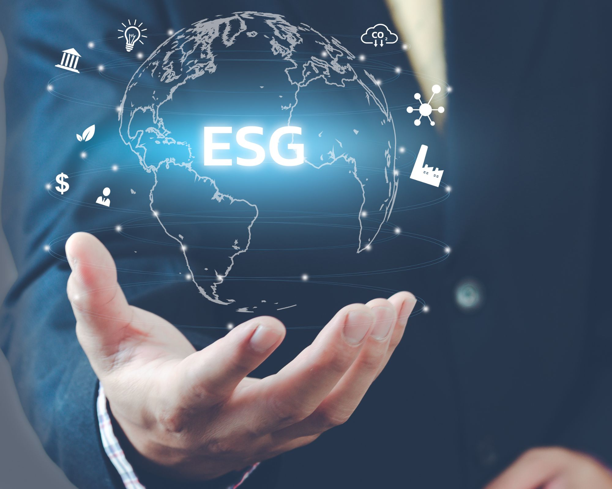
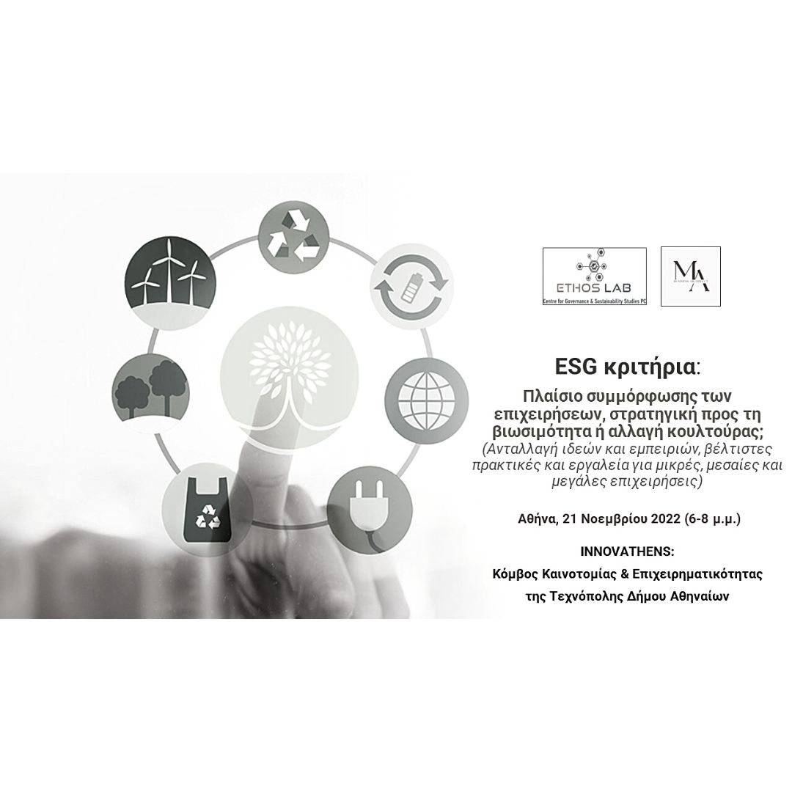
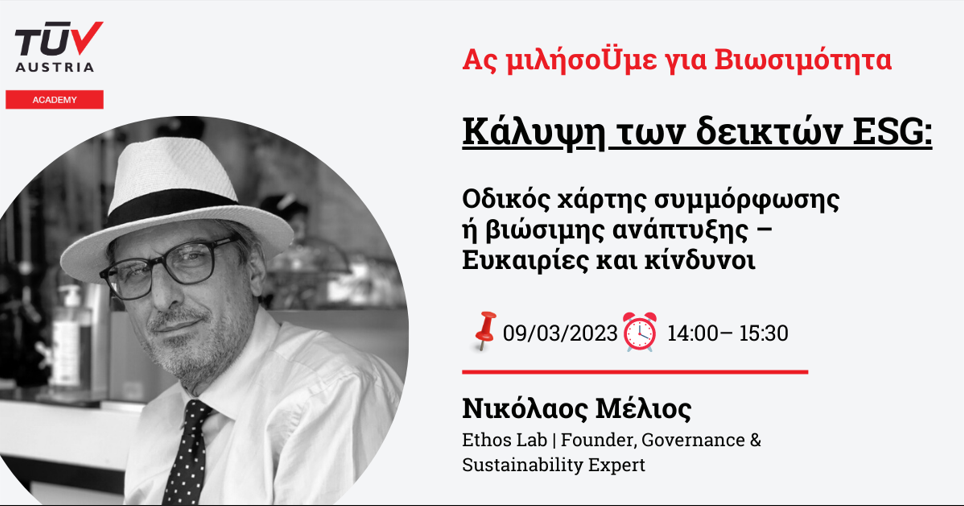
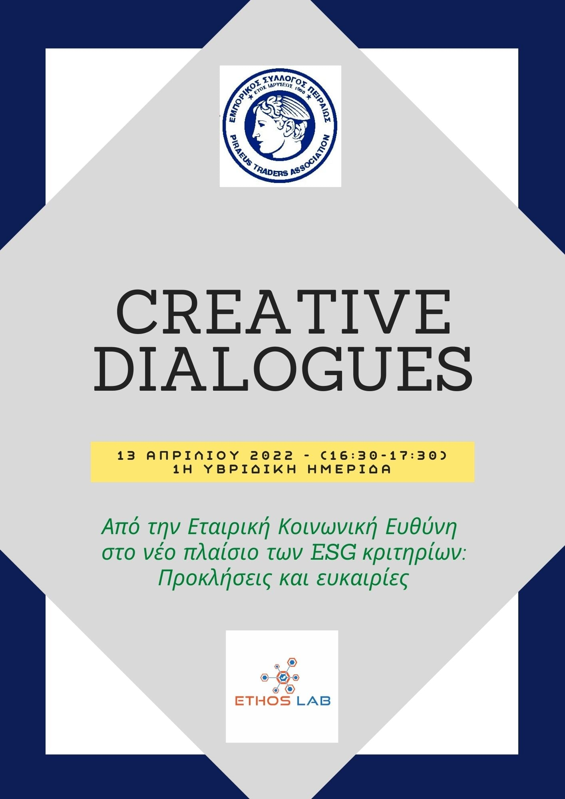
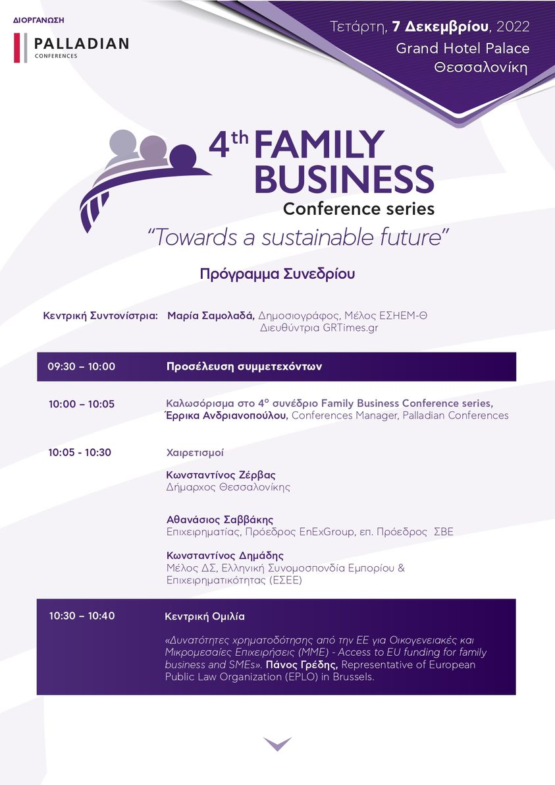
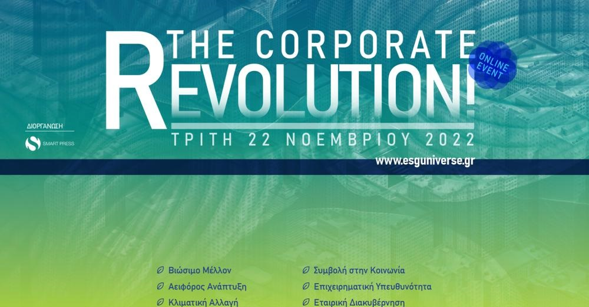
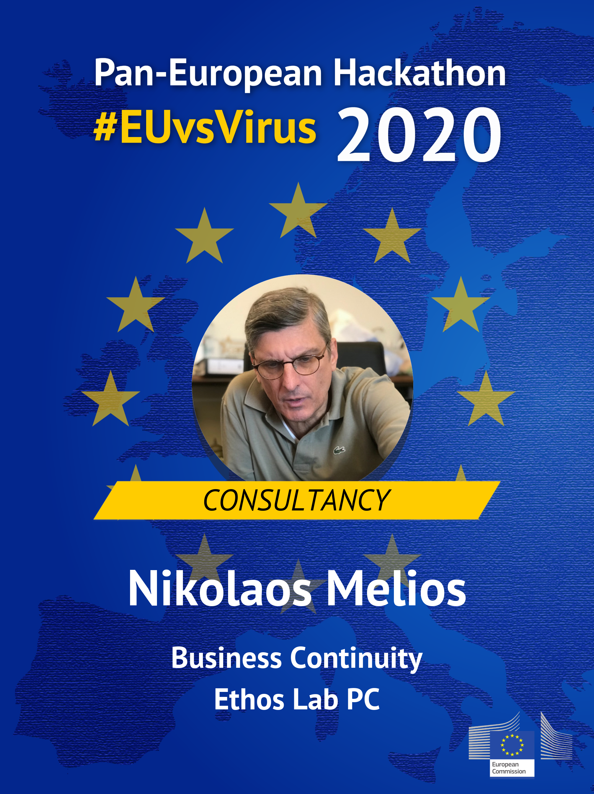
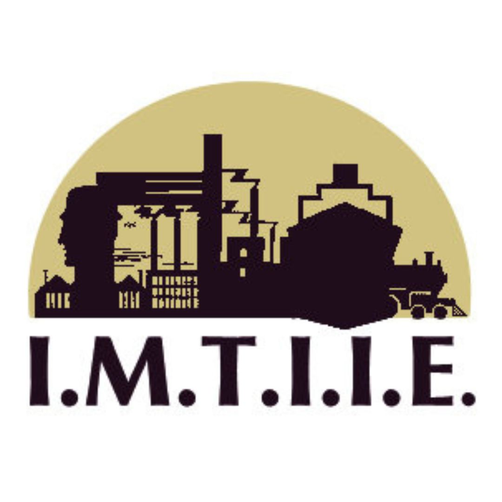
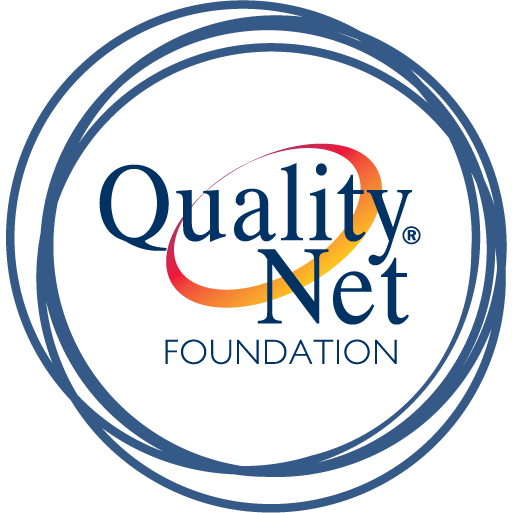
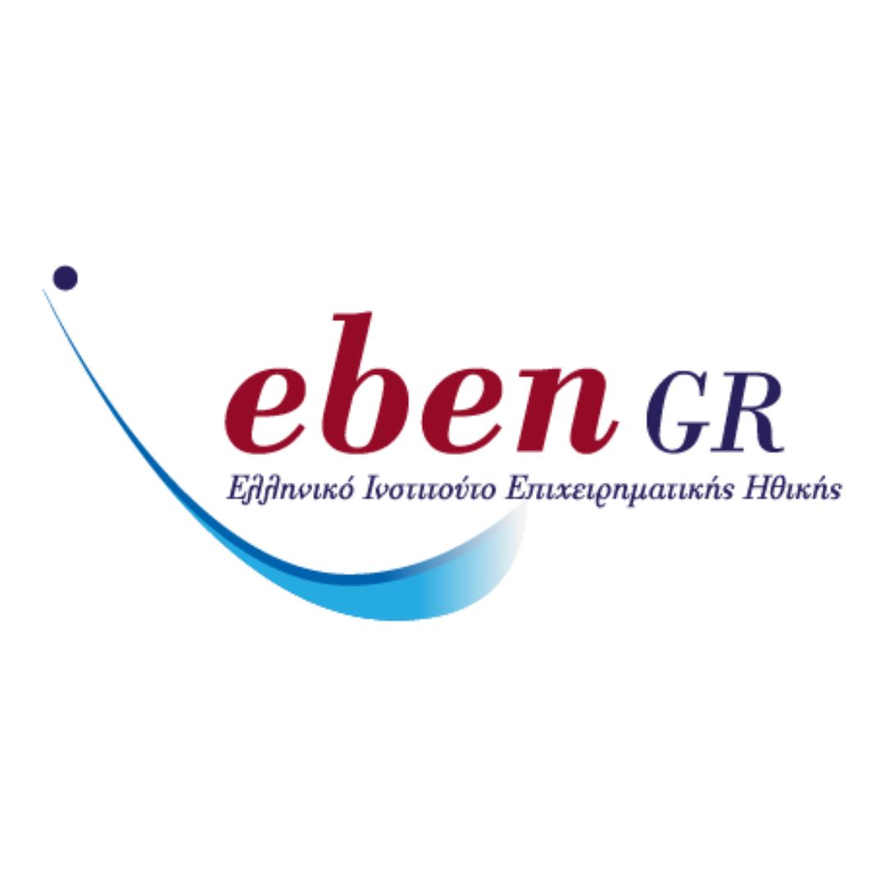

Παροχή εξειδικευμένων συμβουλευτικών υπηρεσιών για την εκπαίδευση και ανάπτυξη ανθρώπινου δυναμικού και εφαρμογή προγραμμάτων coaching και mentoring.

## Οι δράσεις μας

Ημερίδα ESG στο INNOVATHENS

Webinar σε συνεργασια με την TUV Austria Hellas

ESG Conference The Corporate Revolution

EU Hackathon Mentoring

### Κύκλοι σεμιναρίων

-   [Εισαγωγή στην επιχειρηματικότητα](<https://ethoslab.gr/εισαγωγή-στην-επιχειρηματικότητα/\(opens in a new tab\)>)

-   [Χρηματοδοτικά εργαλεία ανάπτυξης επιχειρήσεων](https://ethoslab.gr/χρηματοδοτικά-εργαλεία/)

-   [Βιώσιμη επιχειρηματικότητα και ESG κριτήρια](https://ethoslab.gr/βιώσιμη-επιχειρηματικότητα-και-esg-κριτήρια/)

-   [Διαφορετικότητα, ισότητα, ισονομία και συμπερίληψη](https://ethoslab.gr/διαφορετικότητα-ισότητα-ισονομία-και-συμπερίληψη/)

-   [Επικοινωνία, μάρκετινγκ και δημόσιες σχέσεις](<https://ethoslab.gr/επικοινωνία-μάρκετινγκ-και-δημόσιες-σχέσεις/\(opens in a new tab\)>)

-   [Διαχείριση ανθρώπινου δυναμικού](<https://ethoslab.gr/διαχείριση-ανθρώπινου-δυναμικού/\(opens in a new tab\)>)

### Ανάπτυξη ανθρώπινου δυναμικού

-   [Life coaching](<https://ethoslab.gr/life-coaching/\(opens in a new tab\)>)

-   [Business coaching](<https://ethoslab.gr/business-coaching/\(opens in a new tab\)>)

-   [Mentoring](<https://ethoslab.gr/mentoring/\(opens in a new tab\)>)

### Εκπαιδευτικά εργαστήρια

-   [Ενδυνάμωση ομάδας](<https://ethoslab.gr/ενδυνάμωση-ομάδας/\(opens in a new tab\)>)

-   [Ανάπτυξη δεξιοτήτων](https://ethoslab.gr/ανάπτυξη-δεξιοτήτων/)

-   [Βελτίωση επαγγελματικών δεξιοτήτων](<https://ethoslab.gr/βελτίωση-επαγγελματικών-δεξιοτήτων/\(opens in a new tab\)>)

-   [Εξατομικευμένα εκπαιδευτικά εργαστήρια](<https://ethoslab.gr/εξατομικευμένα-εκπαιδευτικά-εργαστήρια/\(opens in a new tab\)>)

### Εκπαιδευτικές δράσεις

-   [Ημερίδες](<https://ethoslab.gr/ημερίδες/\(opens in a new tab\)>)

-   [Συνέδρια](<https://ethoslab.gr/συνέδρια/\(opens in a new tab\)>)

-   [Forums](<https://ethoslab.gr/forums/\(opens in a new tab\)>)

### Ειδικές εκπαιδεύσεις

-   [Εφαρμογή δεικτών βιωσιμότητας](https://ethoslab.gr/εφαρμογή-δεικτών-βιωσιμότητας/)

-   [Οικογενειακές επιχειρήσεις και μετάβαση](<https://ethoslab.gr/οικογενειακές-επιχειρήσεις-και-μετάβαση/\(opens in a new tab\)>)

-   [Ψηφιακή μετάβαση](https://ethoslab.gr/ψηφιακή-μετάβαση/)

-   [Επιχειρηματική ιστορία και αρχεία επιχειρήσεων](https://ethoslab.gr/επιχειρηματική-ιστορία-και-αρχεία-επιχειρήσεων/)

-   [Διαμεσολάβηση και επίλυση διαφορών](<https://ethoslab.gr/διαμεσολάβηση-και-επίλυση-διαφορών/\(opens in a new tab\)>)

### Αναλυτικές πληροφορίες για τα εκπαιδευτικά μας προγράμματα: [www.esg.edu.gr](http://www.esg.edu.gr)

* * *

## Συνεργαζόμενοι φορείς

Marina Alysandratou Business Architect

ΙΜΤΙΙΕ

Quality Net

Eben Gr
