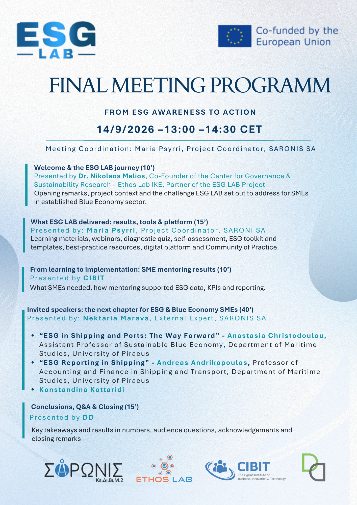

## Mια συμβουλευτική εταιρεία έρευνας και καινοτομίας που αξιοποιεί τη συμπεριφορική επιστήμη και την προηγμένη ανάλυση δεδομένων για τη βελτίωση των δημόσιων πολιτικών και της ζωής των ανθρώπων.

## Οι Υπηρεσίες μας

__

##### Διάγνωση

Αξιοποιούμε ένα ευρύ φάσμα στρατηγικών για να μετατρέπουμε σύνθετες προκλήσεις σε προβλήματα που μπορούν να αντιμετωπιστούν αποτελεσματικά. Εντοπίζουμε τα σημεία όπου η συμπεριφορική επιστήμη μπορεί να έχει τη μεγαλύτερη επίδραση και σας καθοδηγούμε προς λύσεις με ουσιαστικές προοπτικές επιτυχίας.

__

##### Ανάλυση

Αξιολογούμε τι λειτουργεί πραγματικά, χρησιμοποιώντας πειραματικές μεθόδους. Η ανάλυσή μας δεν δείχνει μόνο αν μια πολιτική αποδίδει, αλλά και πώς λειτουργεί — λαμβάνοντας υπόψη τόσο τις θετικές όσο και τις αρνητικές δευτερογενείς επιδράσεις.

__

##### Σχεδιασμός

Σχεδιάζουμε παρεμβάσεις που βασίζονται σε τεκμηριωμένη έρευνα, συνδυάζοντας τη συμπεριφορική οικονομική με μεθόδους συνδιαμόρφωσης, ώστε να αναπτύσσουμε λύσεις πολιτικής προσαρμοσμένες στις ανάγκες και τις συνθήκες κάθε πλαισίου.

__

##### Αξιολόγηση

Αξιολογούμε πολιτικές και τις διαφοροποιημένες επιδράσεις τους σε διαφορετικές ομάδες. Εντοπίζουμε τι λειτουργεί καλύτερα, για ποιους και υπό ποιες συνθήκες, επιτρέποντας τη βελτιστοποίηση και την επέκταση παρεμβάσεων με βάση τεκμηριωμένα δεδομένα.

## Εκδήλωση ESG Lab: Το μέλλον του ESG για τις ΜμΕ της Γαλάζιας Οικονομίας: Τελική συνάντηση του έργου

[ESG LAB](https://ethoslab.gr/esg-lab/)

Τι θα σημαίνει το ESG για τις μικρομεσαίες επιχειρήσεις τα επόμενα χρόνια;

Η τελική συνάντηση του έργου μας, στις 14 Σεπτεμβρίου, θα συγκεντρώσει τα κυριότερα αποτελέσματα, εργαλεία και διδάγματα: από το εκπαιδευτικό υλικό και τα πρακτικά εργαλεία για το ESG έως την εμπειρία καθοδήγησης των μικρομεσαίων επιχειρήσεων.

Ένα ξεχωριστό μέρος της συνάντησης θα είναι αφιερωμένο σε προσκεκλημένους ομιλητές, οι οποίοι θα μοιραστούν τις απόψεις τους για το μέλλον του ESG, την ανταγωνιστικότητα, τη χρηματοδότηση, τις εφοδιαστικές αλυσίδες και τις εξελισσόμενες απαιτήσεις για τις ΜμΕ της Γαλάζιας Οικονομίας.

📅 14 Σεπτεμβρίου 2026 | 13:00–14:30 CET

📍 Πειραιάς & διαδικτυακά

💻 [Συνδεθείτε διαδικτυακά στη συνάντηση](https://lnkd.in/dXsZeidp)

## Τα νέα της Ethoslab

JTNDZGl2JTIwY2xhc3MlM0QlMjJzay13dy1saW5rZWRpbi1wYWdlLXBvc3QlMjIlMjBkYXRhLWVtYmVkLWlkJTNEJTIyMjU2ODI5MDglMjIlM0UlM0MlMkZkaXYlM0UlM0NzY3JpcHQlMjBzcmMlM0QlMjJodHRwcyUzQSUyRiUyRndpZGdldHMuc29jaWFibGVraXQuY29tJTJGbGlua2VkaW4tcGFnZS1wb3N0cyUyRndpZGdldC5qcyUyMiUyMGRlZmVyJTNFJTNDJTJGc2NyaXB0JTNF
