Η Ethos Lab διατηρεί στρατηγικές συνεργασίες με ένα ευρύ δίκτυο φορέων που συμβάλλουν στην προώθηση τεκμηριωμένου σχεδιασμού και αποτελεσματικής υλοποίησης δημόσιων πολιτικών. Οι συνεργασίες μας βασίζονται στον επαγγελματισμό, τη μεθοδολογική ακρίβεια και την κοινή δέσμευση για παραγωγή υψηλής ποιότητας έρευνας, η οποία στηρίζει υπεύθυνες και αποτελεσματικές αποφάσεις.

Συνεργαζόμαστε στενά με φορείς από όλο το φάσμα της τετραπλής έλικας — δημόσιες αρχές, διεθνείς οργανισμούς, οργανώσεις της κοινωνίας των πολιτών, ακαδημαϊκά ιδρύματα και φορείς του ιδιωτικού τομέα — για την αντιμετώπιση σύνθετων κοινωνικοοικονομικών και περιβαλλοντικών προκλήσεων. Μέσα από αυτές τις συνεργασίες, συνδυάζουμε διεπιστημονική επιστημονική εξειδίκευση με προηγμένα αναλυτικά εργαλεία, όπως η συμπεριφορική επιστήμη, η οικονομετρική μοντελοποίηση και οι μεθοδολογίες μηχανικής μάθησης.

Η Ethos Lab παραμένει προσηλωμένο στην ανάπτυξη συνεργατικών σχέσεων που ενισχύουν την ανταλλαγή γνώσης, προωθούν τη μεθοδολογική καινοτομία και στηρίζουν τη διαμόρφωση ανθεκτικών, συμπεριληπτικών και βιώσιμων κοινωνιών.

Οι συνεργάτες και οι πελάτες μας περιλαμβάνουν:

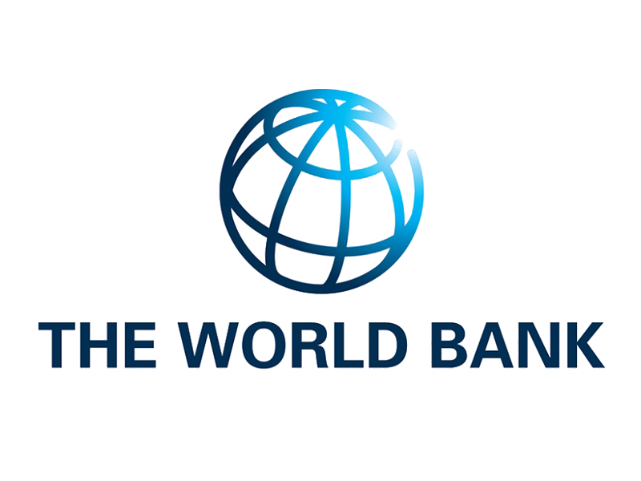

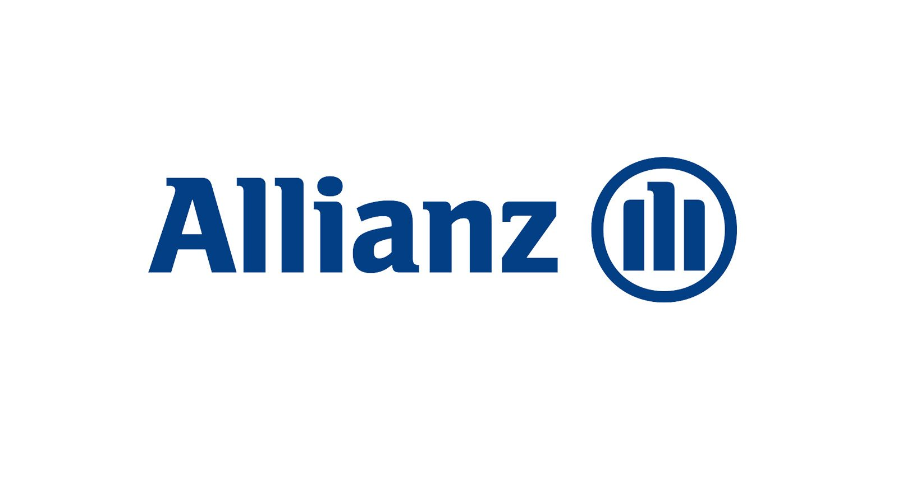

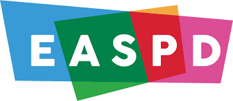

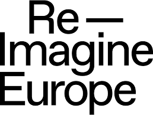

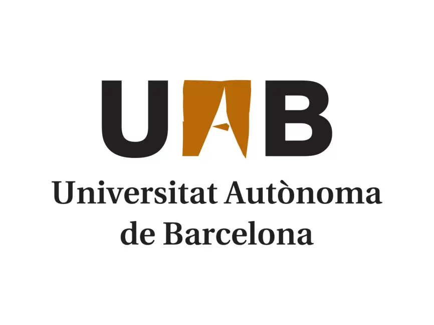

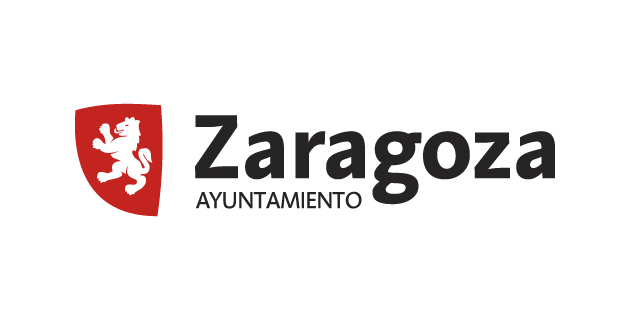

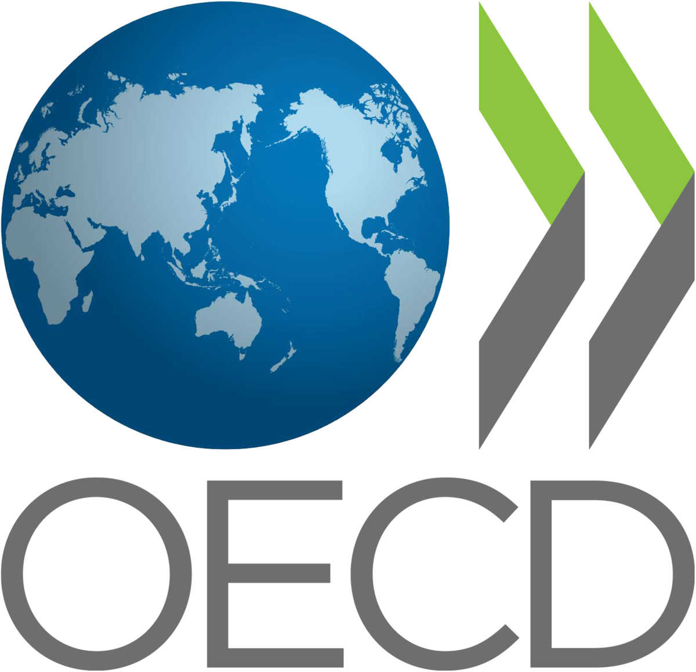

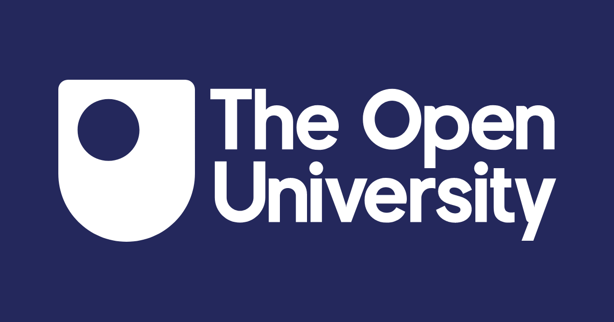

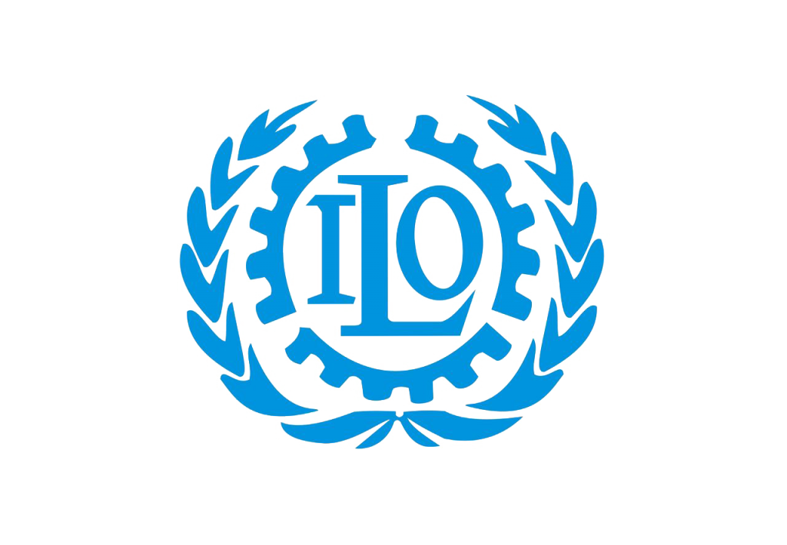

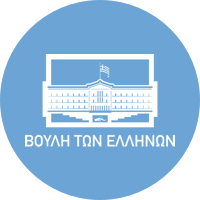

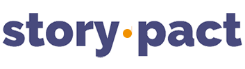

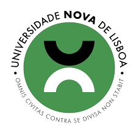

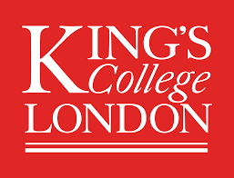

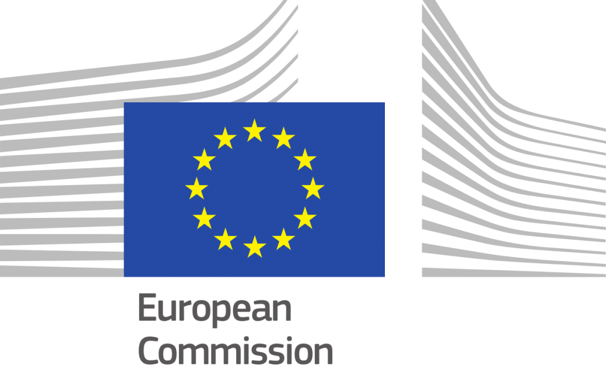

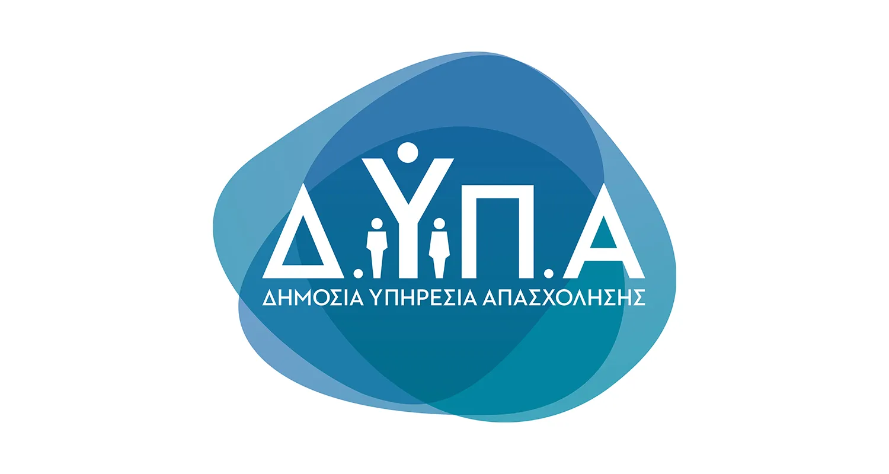

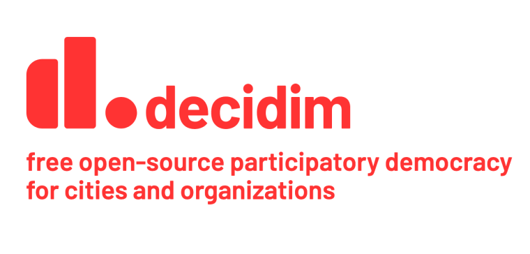

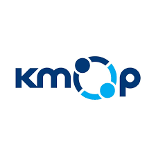

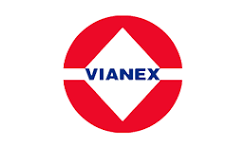

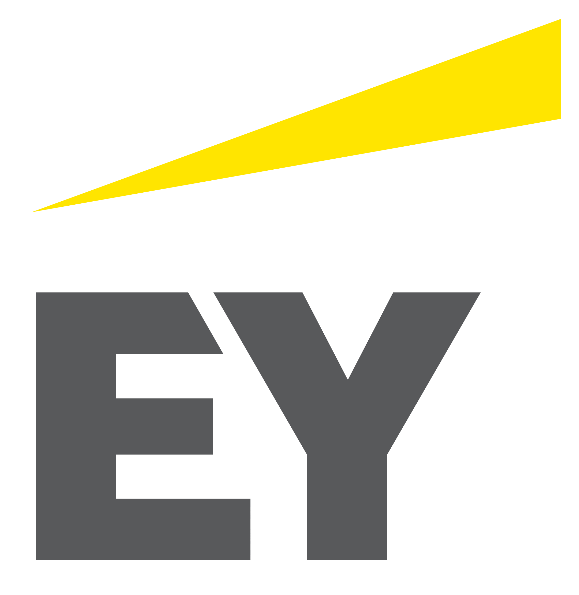

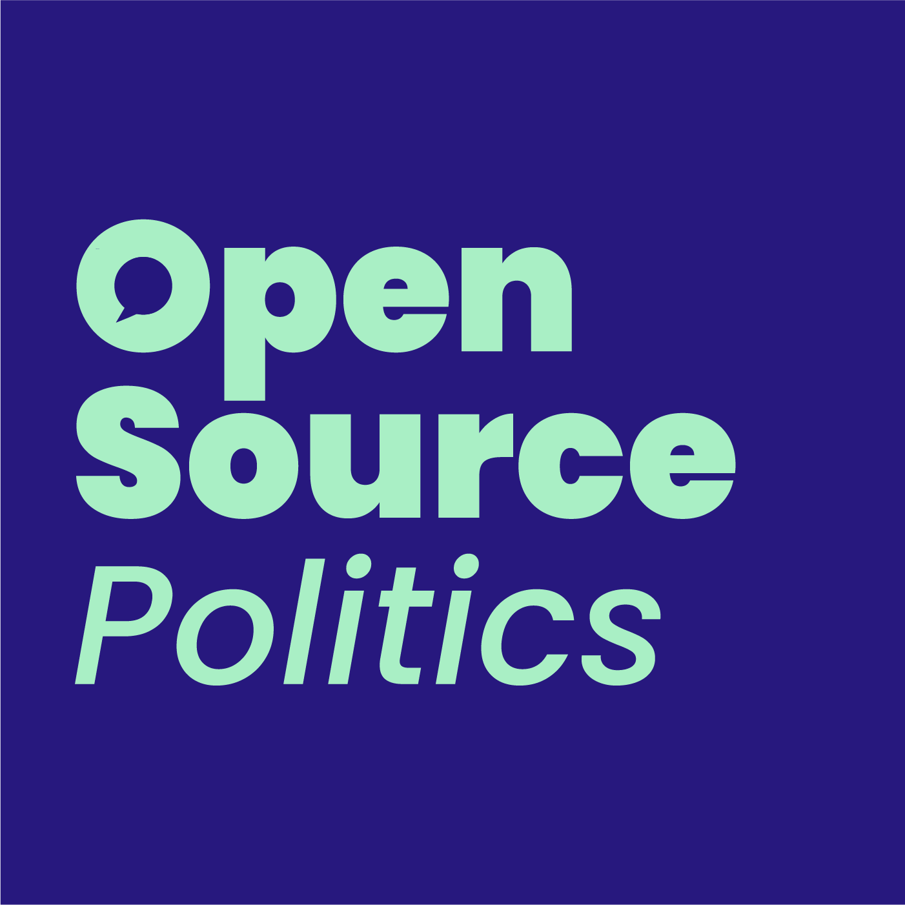

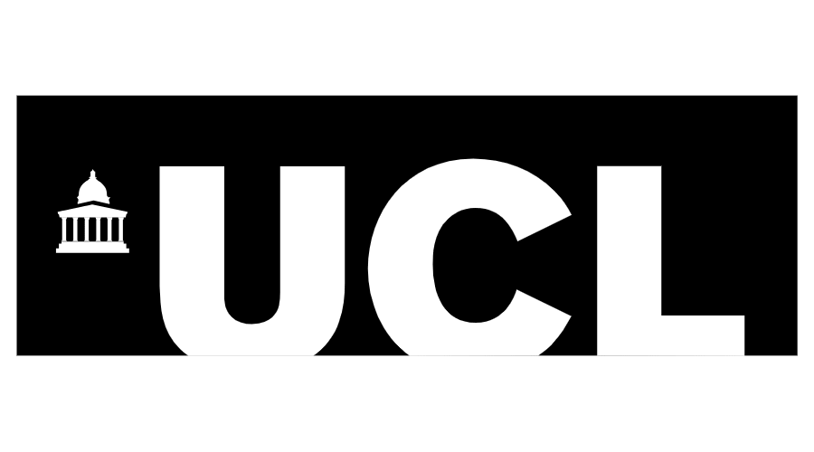

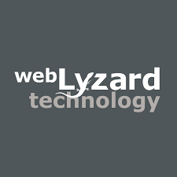
