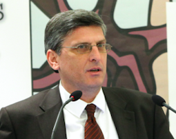
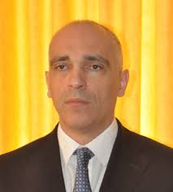

Το Κέντρο Έρευνας για τη Διακυβέρνηση και την Αειφορία Ι.Κ.Ε. “Ethos Lab” είναι μια νεοφυής ΜμΕ η οποία εστιάζει στην έρευνα, στις συστάσεις πολιτικής και στην παροχή εξειδικευμένων συμβουλών σε θέματα που σχετίζονται με την οικονομική πολιτική, τη βιωσιμότητα, τις πράσινες πολιτικές και την κοινωνική ένταξη.

Το Ethos Lab στοχεύει:

1.  Στην παροχή ερευνητικών συμβουλών, τεκμηρίων και συστάσεων πολιτικής βάσει δεδομένων για θέματα που σχετίζονται με τη διακυβέρνηση και τη βιωσιμότητα.
2.  Στην χρήση καινοτόμων και υπερσύγχρονων μεθοδολογιών για τη διασύνδεση της τριτοβάθμιας εκπαίδευσης και της ακαδημαϊκής έρευνας με την επιχειρηματικότητα.
3.  Στην εκπόνηση εξαμηνιαίων εκθέσεων πολιτικής για θέματα πολιτικής οικονομίας, μετανάστευσης, βιωσιμότητας και διακυβέρνησης στην Ελλάδα και την Ε.Ε.
4.  Στη συνεργασία με κρατικούς και μη κρατικούς φορείς για την προώθηση της χρήσης λύσεων που προσδιορίζονται από την ακαδημαϊκή έρευνα για παρεμβάσεις πολιτικής.

Ιδρυτές

Το “Ethos Lab” – Κέντρο Έρευνας Διακυβέρνησης και Αειφορίας ιδρύθηκε το 2019

από τους Δρ. Γεώργιο Μέλιο και Νικόλαο Μέλιο στην Αθήνα, Ελλάδα.

#### Dr. George Melios

CEO / Founder

#### Nikolaos Melios

Founder

## Team of experts

Ethos Lab’s team consists of a number of Resident and Non-Resident researchers with multidisciplinary expertise.

Prof. Tzivanakis is an economist with expertise on welfare, economic growth and institutions. He implements the policy and research agenda of Ethos Lab

### Prof. Nikolaos Tzivanakis

Head of Policy & Research

Prof Logothetis is an academic economist with expertise in economic growth, public economics and economic history. He is a Research Affiliate of Ethos Lab on issues of economic growth and institutions

### Prof. Vasileios Logothetis

Research Affiliate

Ms Petridou is an psychologist and educator. She holds an M.Sc. in Developmental Psychology and currently leads Ethos Lab educational and capacity building programs

### Ms Dimitra Petridou

Education Policy Expert

Giorgios Maaraaoui is a doctoral candidate in economics with a focus on causal inference and applied microeconomics. In Ethos Lab he provides expertise in causal inference

### Giorgio Maaraoui

Causal Inference expert

Mr Vasilopoulos is a computer scientist and web developer. He curates the digital content of Ethos Lab

### Georgios Vasilopoulos

IT Expert

Ms Sleiman is an economist and data analyst. She has significant expertise in applied microeconomics and data analytics. Her role in Ethos Lab is to design and implement welfare evaluation projects

### Yara Sleiman

Data Analyst

## Advisory Board

Ethos Lab’s advisory board consists of a number of academic and industry experts with multidisciplinary expertise.

Antonios Rovolis, Εconomist, BA Athens, MA Sussex, PhD LSE is Associate Professor of Spatial and Urban Economics at the Department of Economic and Regional Development, Panteion University of Athens.

### Prof. Antonios Rovolis

Advisory Board

Apostolos holds a PhD in Economic History from Bradford University and specialises in financial services. He has more than 25 years of experience in large PPP/PFI projects across the EMEA region

### Dr. Apostolos Papadopoulos

Advisory Board

Prof. Pepelasi, a graduate of Harvard and the London School of Economics, is Professor Emerita in the Department of Economics at the Athens University of Economics and Business (AUEB) and currently a visiting Professor at the University of Athens.

### Prof. Ioanna Sapfor Pepelasi

Advisory Board

Ms Soulaki holds degrees in Political Sciences (B.A) and Management (B.A). She has more than 38 years of experience in the private sectors, leading for 2 decades the CSR strategy of Hellenic Petroleum group

### Rania Soulaki

Advisory Board - CSR Expert

Ms Papadopoulou is a 360 Communications and Corporate Affairs senior executive with a demonstrated history of strong performance in diverse sectors

### Angeliki Papadopoulou

Advisory Board - Communications Expert

Prof. Bithas is a Professor of Environmental and Natural resource Economics at Panteion University, Athens, Greece

### Prof. Kostas Bithas

Advisory Board - Enviromental Expert
