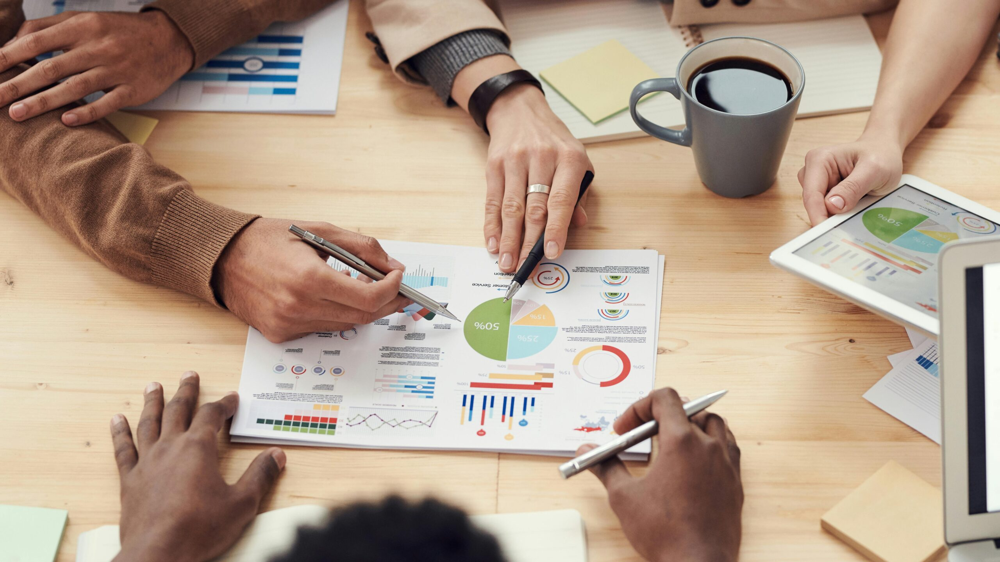
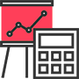
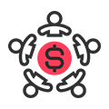
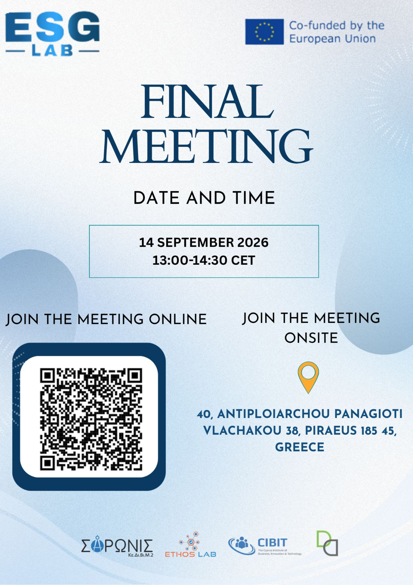

## We are a research and innovation consultancy which uses **behavioral insights** and **advanced data analytics** to improve policy outcomes and people’s lives.

## Our Services

__

##### Diagnose

We use a range of strategies to turn complex challenges into solvable problems. We can pinpoint where behavioural insights can have the biggest impact and guide you toward promising solutions.

__

##### Measure

We measure what actually works using experimental & quasi-experimental methods. Our analysis tells you not just whether a policy works, but how - accounting for positive and negative spillovers.

__

##### Design

We create interventions grounded in rigorous research, combining behavioral economics with co-design methods to develop policy solutions that work for each context.

__

##### Evaluate

We evaluate policies and their heterogeneous effects. We identify what works best, for whom, and under what conditions—enabling evidence-based optimization of interventions and scaling-up

## 📢 The Future of ESG for Blue Economy SMEs: Final Project Meeting

[ESG LAB](https://ethoslab.gr/esg-lab/)

What will ESG mean for SMEs in the next few years?  
Our Final Meeting on 14 September will bring together the main results, tools and lessons of the project, from ESG learning resources and practical tools to the mentoring experience with SMEs.  
A special part of the meeting will also be dedicated to invited speakers, who will share perspectives on the future of ESG, competitiveness, finance, supply chains and the evolving expectations for Blue Economy SMEs.

📅 14 September 2026 | 13:00–14:30 CET

📍 Piraeus & Online

💻 Join us online:

[https://lnkd.in/dXsZeidp](https://lnkd.in/dXsZeidp)

Join the conversation and explore how SMEs can move from ESG awareness to real implementation.

## Latest from Ethos Lab

JTNDZGl2JTIwY2xhc3MlM0QlMjJzay13dy1saW5rZWRpbi1wYWdlLXBvc3QlMjIlMjBkYXRhLWVtYmVkLWlkJTNEJTIyMjU2ODI5MDglMjIlM0UlM0MlMkZkaXYlM0UlM0NzY3JpcHQlMjBzcmMlM0QlMjJodHRwcyUzQSUyRiUyRndpZGdldHMuc29jaWFibGVraXQuY29tJTJGbGlua2VkaW4tcGFnZS1wb3N0cyUyRndpZGdldC5qcyUyMiUyMGRlZmVyJTNFJTNDJTJGc2NyaXB0JTNF
