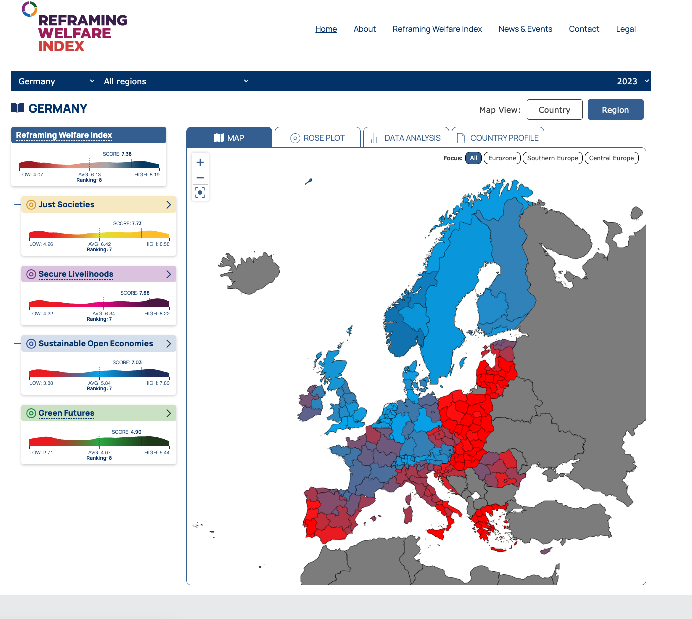
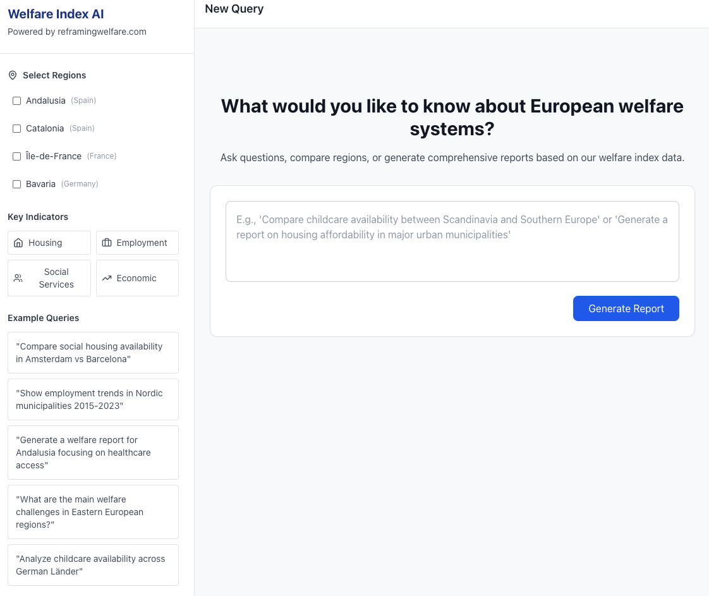

## Reframing Welfare Index

The Reframing Welfare Index (RWI), is a holistic measure of welfare designed to overcome the limitations of traditional metrics, which seeks to capture the intricate tapestry of social and individual well-being across European regions. The RWI identifies 21 distinct pillars of welfare, each composed of multiple indicators, and categorizes them into four foundational domains. Each domain consists of multiple indicators.

## EU Regions Welfare AI Editor

Our Welfare Index AI transforms how policymakers and researchers analyze regional welfare across Europe. Built on agentic RAG architecture and powered exclusively by our proprietary Reframing Welfare Index data covering 250+ European regions, this AI editor generates evidence-based reports, comparative analyses, and trend insights without hallucinations. Unlike generic AI tools that guess or confabulate, every claim is grounded in verified data on housing affordability, employment, social services, economic indicators, and environmental quality. Ask natural language questions, compare regions, or generate comprehensive reports—and receive responses backed by real data, complete with sources and confidence indicators. From understanding childcare availability in German Länder to analyzing welfare challenges across Eastern Europe, the AI Editor delivers the rigor of manual analysis with the speed of automation.
