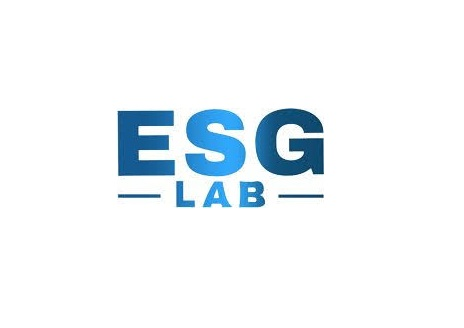

### [ESG Lab](https://ethoslab.gr/project/esg-lab/)

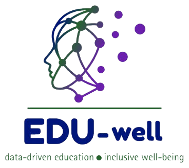

### [EDU-well](https://ethoslab.gr/project/edu-well/)

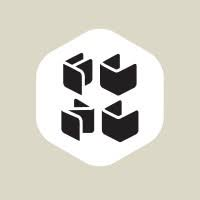

### [Ethos-FCNC partnership for ESG](https://ethoslab.gr/project/ethos-fcnc-partnership-for-esg/)

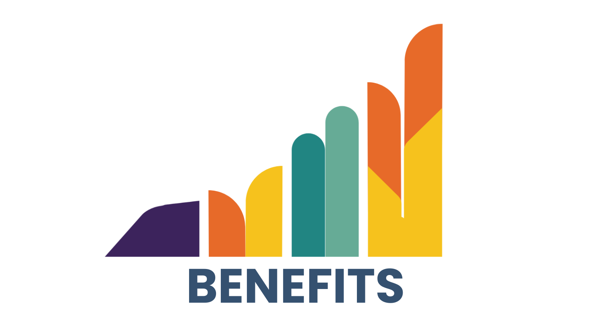

### [BENEFITS](https://ethoslab.gr/project/benefits/)

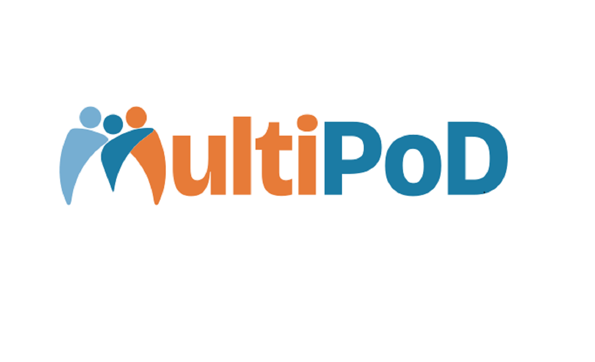

### [MultiPoD – Public Spaces for Citizen Deliberation](https://ethoslab.gr/project/multipod-multilingual-and-multicultural-spaces-for-political-deliberation/)

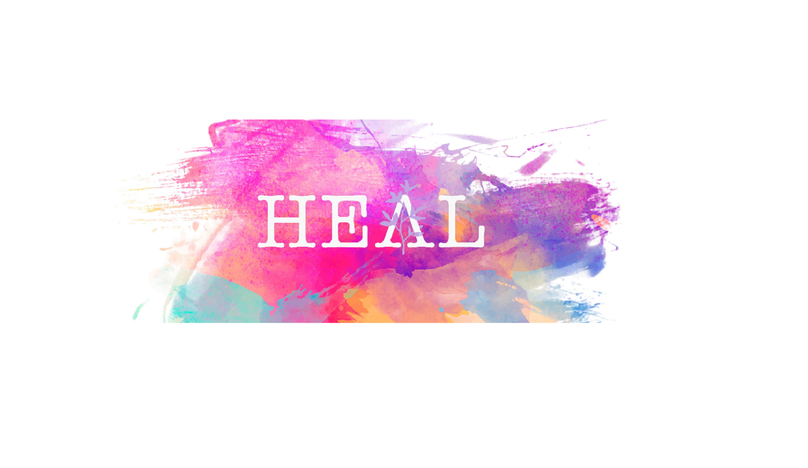

### [HEAL – enHancing rEcovery and integrAtion through networking, empLoyment training and psychological support for women victims of trafficking](https://ethoslab.gr/project/heal-enhancing-recovery-and-integration-through-networking-employment-training-and-psychological-support-for-women-victims-of-trafficking/)

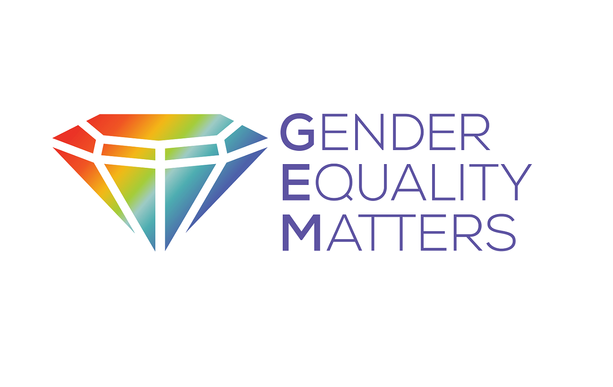

### [GEM – Gender Equality Matters](https://ethoslab.gr/project/gem-gender-equality-matters/)

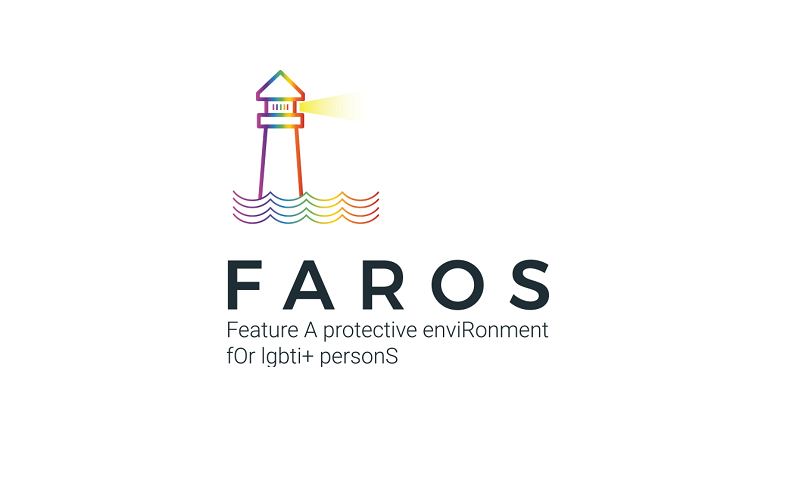

### [FAROS – FEATURE A PROTECTIVE ENVIRONMENT FOR LGBTI+ PERSONS](https://ethoslab.gr/project/faros-feature-a-protective-environment-for-lgbti-persons/)

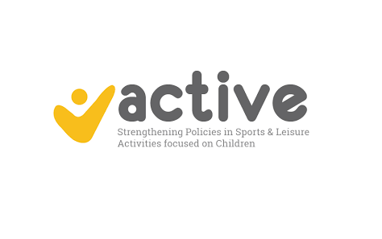

### [ACTIVE – Strengthening Policies in Sports and Leisure Activities focused on Children](https://ethoslab.gr/project/active-strengthening-policies-in-sports-and-leisure-activities-focused-on-children/)

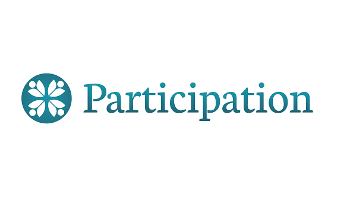

### [PARTICIPATION -Analysing & Preventing Extremism through Participation Horizon 2020](https://ethoslab.gr/project/participation-analysing-preventing-extremism-through-participation-horizon-2020/)

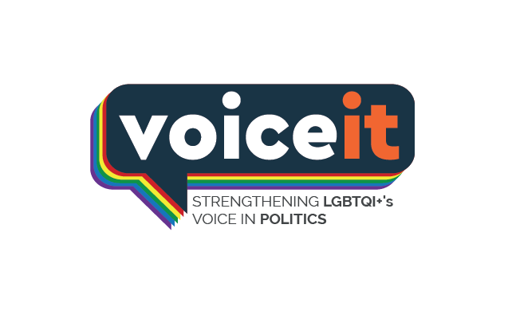

### [VoiceIt](https://ethoslab.gr/project/voiceit/)

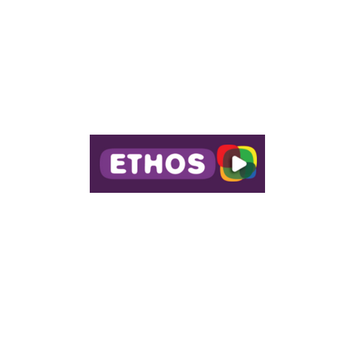

### [E.T.Ho.S – EU’s R.E.C Programme 2014-2020](https://ethoslab.gr/project/personal-injury/)

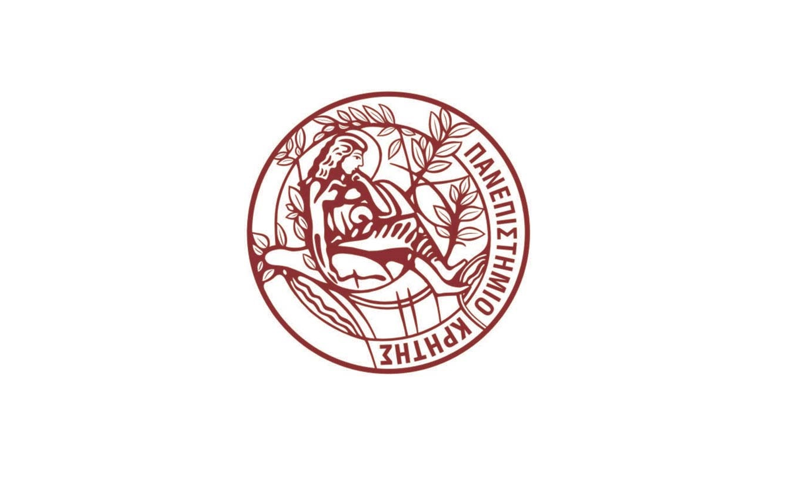

### [Γραφείο Μεταφοράς Τεχνολογίας Πανεπιστημίου Κρήτης](https://ethoslab.gr/project/business-real-estate/)

[More](#)
