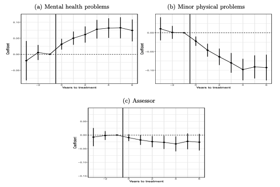

## Our work with researchers and clients across the world has produced valuable impact. Find out how, and more about how we work, by exploring the insights below.

# [**The Employment Effects of Disability Benefits Without Work Restrictions (B. Klein Teeselink & G. Melios)**](https://ethoslab.gr/project/the-employment-effects-of-disability-benefits-without-work-restrictions/)

August 2025

Disability benefits typically reduce labor force participation through raising non-labor income (income effects) and phasing out benefits with earnings (substitution effects). Distinguishing these mechanisms matters for policy design, as income effects are non-distortionary while substitution effects generate deadweight loss. We isolate pure income effects for the UK’s Personal Independence Payment (PIP) program, which supports disability-related costs without work restrictions or earnings tests. Following a 2013 reform, we use differential eligibility changes across health conditions and quasi-random regional assignment to different assessment providers in a difference-in-differences design with matched panel data. Despite substantial benefit receipt changes (1.8-5.9 percentage points across strategies), we only find positive employment effects in stricter assessment regions. For individuals who gain or lose benefits due to condition-specific eligibility changes, the effects are close to zero. These findings suggest that disability benefits designed as cost-of-living supplements can provide financial security without necessarily disincentivizing work.
