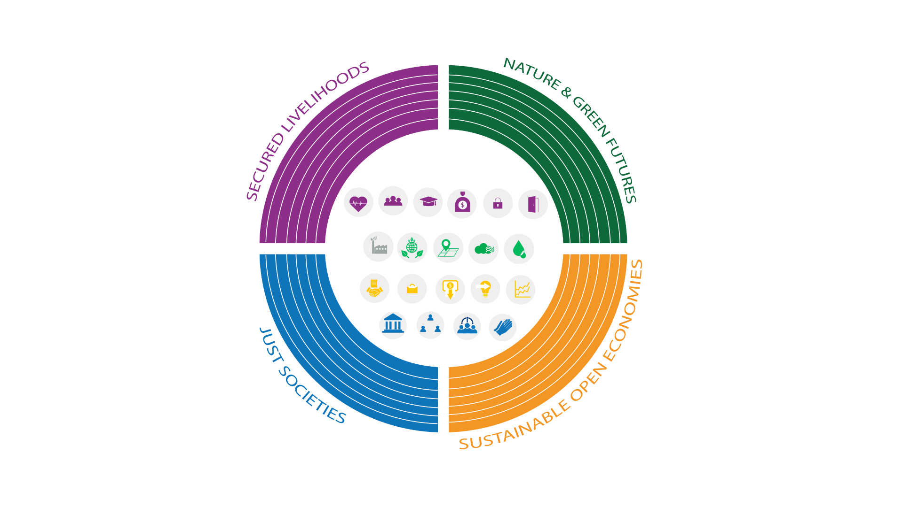
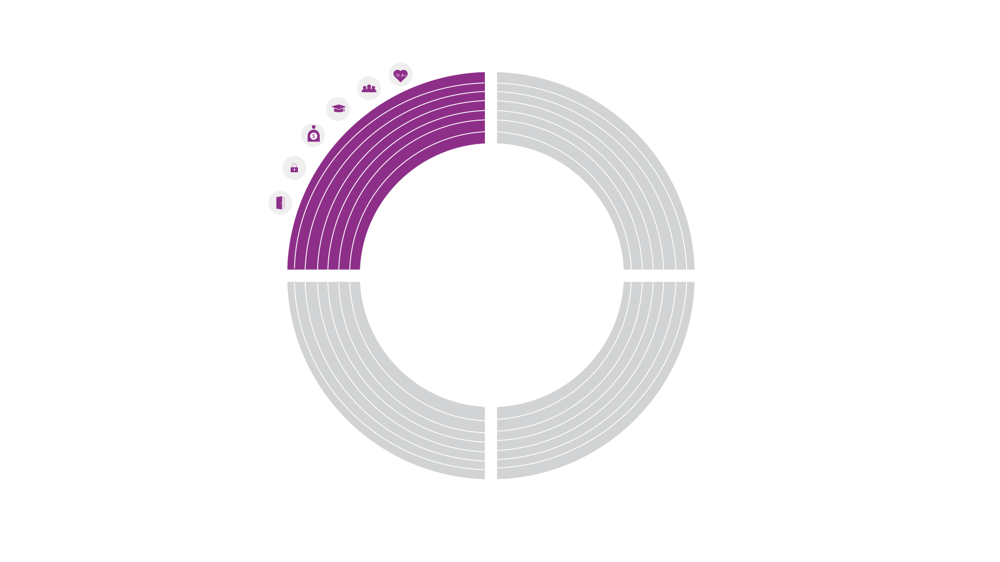
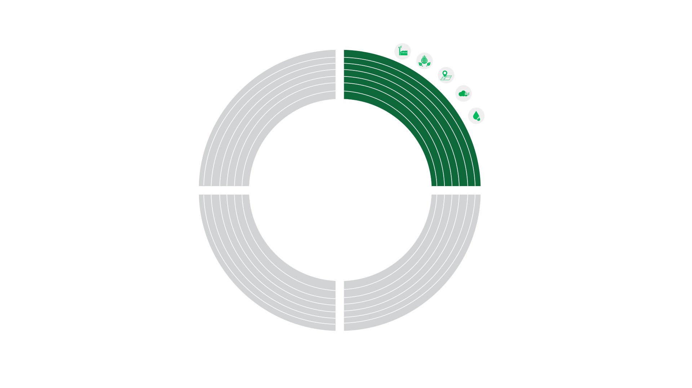
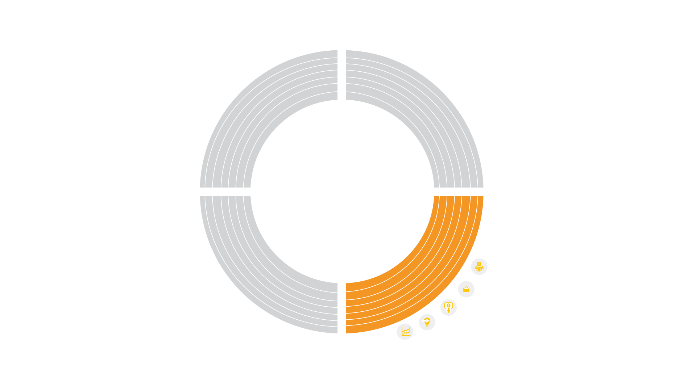
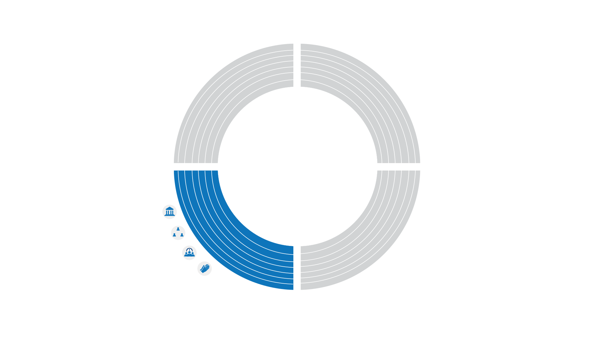

The Reframing Welfare Index (RWI), a holistic measure of welfare designed to overcome the limitations of traditional metrics, seeks to capture the intricate tapestry of social and individual well-being across European regions. The RWI identifies 21 distinct pillars of welfare, each composed of multiple indicators, and categorizes them into four foundational domains. Each domain consists of multiple indicators.

The Secured Livelihoods foundation explores the intricate web of resources and conditions necessary for individuals and societies to not only survive, but to truly flourish. It recognises that well-being encompasses more than just meeting basic needs; it’s about having the opportunity to access essential services, pursue personal aspirations, and live free from fear and deprivation. This foundation is built on six interconnected pillars, each representing a critical dimension of a secure and fulfilling life. Together, these pillars offer a comprehensive understanding of the multifaceted nature of secured livelihoods, allowing us to identify areas for improvement and work towards a future where everyone has the opportunity to thrive.

The Nature and Green Future foundation encapsulates the critical interplay between the natural environment and human activities, assessing both the current state of our planet’s health and the ongoing efforts to transition toward a more sustainable future. This foundation rests on five interconnected pillars, each representing a critical aspect of our relationship with the natural world. Together, these pillars offer a comprehensive understanding of the complex relationship between humanity and the natural world. They shed light on the current state of our environment, the challenges we face, and the proactive steps being taken towards a greener and more sustainable future. By examining these interconnected aspects, we gain deeper insights into the delicate balance between human activities and the environment, enabling us to chart a course towards a more harmonious and sustainable coexistence.

The Sustainable Open Economies foundation captures the interconnected economic structures that drive prosperity and well-being. It evaluates an economy’s ability to foster competitiveness, innovation, and inclusive growth through open markets and sustainable practices. This foundation rests on five interconnected pillars. Output examines the health and dynamism of an economy through indicators like regional GDP, income distribution, productivity, and export orientation. Employment assesses the quantity, quality, and inclusivity of employment opportunities, considering factors such as unemployment rates, gender pay gaps, and youth employment. The Business Environment evaluates the regulatory framework and ease of doing business. The Investment Environment gauges the attractiveness of an economy for domestic and foreign investment. Innovation examines the capacity for generating, adopting, and diffusing new ideas and technologies. Together, these pillars reveal the complex factors shaping the economic landscape and sustainability. By examining these fundamental aspects, we gain deeper insights into the dynamics of sustainable open economies and the pathways to long-term success.

The Just Societies foundation examines the intricate dynamics between individuals and the formal and informal structures that shape their collective well-being. This foundation rests upon five interconnected pillars—Formal Institutions, Human Rights, Informal Institutions, Freedom, and Social Capital—that together create the conditions for an inclusive, equitable, and just society. Each pillar presents a distinct facet of social justice. Formal Institutions assess the effectiveness and fairness of governance, focusing on trust in government, perceived corruption, and political participation. Human Rights evaluates a society’s commitment to protecting the rights and dignity of all, particularly marginalised groups. Informal Institutions explore the norms, values, and social networks that foster cooperation and cohesion, considering factors like prosocial behavior and the role of religion. Freedom examines the extent to which individuals feel empowered to express themselves and participate in civic life, while Social Capital gauges the strength of relationships, trust, and shared responsibility within a society. By delving into these five pillars, we can gain a comprehensive understanding of the complex tapestry of a just society, identifying both strengths and areas for improvement.

    
